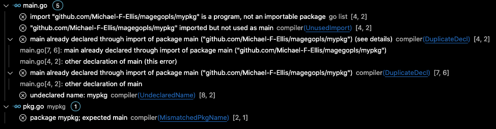

# Magegopls
Code to reproduce a problem encountered in `vscode 1.61.2` using
-  `mage v1.11.0-2-g4cf3cfc` 
-  `go 1.17.2`
-  `gopls v0.7.3`

Briefly, the problem is that vscode reports a slew of error even though the code in the repo builds and runs with no errors or warnings from `mage`, `go vet` or `go build`.

The problem appears to be that `vscode` (via `gopls`)  isn't honoring the `//go:build mage` directive in `mypkg/magefile.go`. 

The complaints seems to originate because magefiles want to have `package main` specified. 

I can make the `vscode` complaints go away by changing that to `package mypkg`, but then mage is no longer able to run.

I've used mage in this manner prior to the advent of `go1.17` in large projects requiring extensive code generation without getting vscode complaints. 
